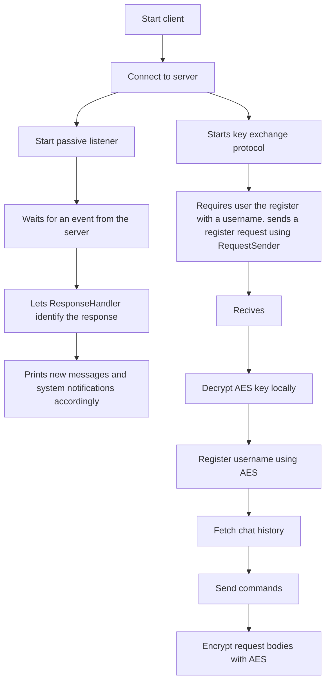
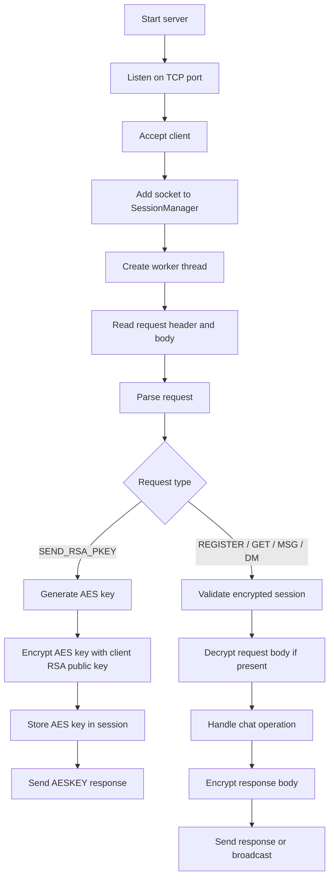

# OnlineChat (Winsock TCP Chat Server + Client)

[](https://en.cppreference.com/w/cpp/17)


OnlineChat is an educational **TCP chat system** written in **C++17** for Windows using **Winsock**.

The project includes both a server and a console client. The server accepts multiple clients concurrently, stores public chat messages in a local text file that server as a database, broadcasts public updates, supports direct(private) and global messages, and performs a encrypted session setup using OpenSSL.

## Features

- **TCP server** using Winsock
- **Configurable server port** in `main.cpp`
- **Multiple concurrent clients** using a thread-per-client worker model
- **Custom fixed-size header protocol** for requests and responses
- **RSA + AES session setup** before registration or chat requests
- **AES-256-CBC encrypted request/response bodies** after the handshake
- **Public chat history** stored in a server-side text file
- **Broadcasts** for public messages and join/leave notifications
- **Direct messages (DMs)** to a specific registered username
- **Passive client listener thread** using `select()` to print incoming messages asynchronously


## Dependencies

- Windows
- Visual Studio with C++17 support
- Winsock (`Ws2_32.lib`)
- OpenSSL for Windows
  - Headers are expected under `Dependencies/OpenSSL-Win64/Include`
  - The project currently links against OpenSSL libraries from a path like:

```text
C:\Program Files\OpenSSL-Win64\lib\VC\x64\MDd
```

If your OpenSSL installation is in a different location, update the project properties in Visual Studio:

- **C/C++ > General > Additional Include Directories**
- **Linker > General > Additional Library Directories**
- **Linker > Input > Additional Dependencies**

The project links against:

```text
libssl.lib; libcrypto.lib; Ws2_32.lib; Crypt32.lib
```

## How it works

### Server-side

1. `Server::launch()` starts the listening socket.
2. `Server::acceptConnections()` blocks on `accept()` in a loop.
3. Each accepted socket is:
   - added to `SessionManager`
   - handled by a dedicated `ClientConnectionWorker` thread
4. The worker thread repeatedly:
   - reads a request header and body with `RequestReader`
   - parses the request with `ServerProtocol`
   - routes it to `RequestHandler`
5. `RequestHandler`:
   - validates whether the request is allowed in the current session state
   - performs RSA/AES session setup when receiving `SEND_RSA_PKEY`
   - decrypts AES-protected incoming request bodies
   - reads/writes public chat data using `DataBaseManager`
   - encrypts response bodies when an AES session key exists
   - sends direct responses or broadcasts through `NetworkIO`

### Client-side

1. `UserClient::startClient()` connects to the server and starts the passive listener.
2. The client generates an RSA key pair and sends the public key to the server.
3. The client receives the RSA-encrypted AES key and decrypts it locally.
4. The client registers a username.
5. The client fetches the chat history.
6. User commands are converted into protocol requests by `ClientProtocol` and sent through `RequestSender`.
7. Incoming server responses are read by the passive listener, decrypted when needed, and printed asynchronously.

## Running

The executable can run in either server mode or client mode.

### Start the server

```bat
OnlineChat.exe server
```

If no mode is supplied, the program defaults to server mode.

### Start a client

```bat
OnlineChat.exe client
```

By default, the sample code connects clients to:

```text
127.0.0.1:5555
```

The port is defined by `PORT` in `main.cpp`.

## Client commands

After starting a client, enter a username when prompted. The client then performs the RSA/AES handshake, registers the username, and fetches the chat log.

Available commands:

```text
/msg <message>             Send a public message
/dm <message> <username>   Send a direct message
/get                       Fetch the chat log
/reg                       Try to register again with the startup username
/help                      Print available commands
q                          Quit
```

Note: the current console parsing reads message text with `std::cin >> msg`, so messages are read as a single whitespace-delimited token.

## Workflows

### Client workflow



### Server workflow



## Protocol

OnlineChat uses fixed-size ASCII headers followed by a variable-size body.

### Request format

```text
REQUEST (TCP)
┌─────────────────────────── HEADER (7 bytes) ───────────────────────────┐
│  LEN (4 ASCII digits)  │  TYPE (2 ASCII digits)  │  VER (1 ASCII digit) │
└────────────────────────────────────────────────────────────────────────┘
┌──────────────────────────── BODY (LEN bytes) ───────────────────────────┐
│ payload bytes                                                            │
└────────────────────────────────────────────────────────────────────────┘
```

Header fields:

| Field | Size | Meaning |
| --- | ---: | --- |
| `LEN` | 4 bytes | Body length, zero-padded ASCII decimal |
| `TYPE` | 2 bytes | Request type, zero-padded ASCII decimal |
| `VER` | 1 byte | Protocol version |

Request types:

| Code | Name | Body |
| ---: | --- | --- |
| `01` | `GET_CHAT` | Empty body |
| `02` | `SEND_MESSAGE` | AES-encrypted public message |
| `03` | `REGISTER` | AES-encrypted username |
| `04` | `DIRECT_MESSAGE` | `receiver:ciphertext` |
| `05` | `SEND_RSA_PKEY` | Plain RSA public key in PEM format |

Example unencrypted RSA public-key request header for a 451-byte key using protocol version `1`:

```text
0451051
```

Example encrypted `SEND_MESSAGE` header for a 64-byte encrypted payload:

```text
0064021
```

### Direct message body format

Direct messages keep the receiver name outside the encrypted message text so the server can route the message:

```text
receiver_username:<AES encrypted message bytes>
```

The message content is AES encrypted. The receiver username is used for routing.

### Response format

```text
RESPONSE (TCP)
┌────────────────────────── HEADER (6 bytes) ────────────────────────────┐
│  LEN (4 ASCII digits)  │  CODE (2 ASCII digits)                         │
└────────────────────────────────────────────────────────────────────────┘
┌──────────────────────────── BODY (LEN bytes) ───────────────────────────┐
│ payload bytes                                                            │
└────────────────────────────────────────────────────────────────────────┘
```

Header fields:

| Field | Size | Meaning |
| --- | ---: | --- |
| `LEN` | 4 bytes | Body length, zero-padded ASCII decimal |
| `CODE` | 2 bytes | Response code, zero-padded ASCII decimal |

Response codes:

| Code | Name | Meaning |
| ---: | --- | --- |
| `00` | `OK` | Request succeeded |
| `01` | `ABORTED_ERR` | Operation was cancelled |
| `02` | `NOT_REGISTER_ERR` | Client must register first |
| `03` | `USER_NOT_FOUND_ERR` | DM receiver was not found |
| `04` | `DATABASE_ERR` | Server database operation failed |
| `05` | `PROTOCOL_ERR` | Invalid protocol/request state |
| `06` | `REGISTRY_ERR` | Username registration failed |
| `07` | `ALREADY_REQUESTED_ERR` | Request is not allowed again in current state |
| `10` | `AESKEY` | Contains RSA-encrypted AES session key |
| `11` | `AESKEY_ERR` | AES key generation/exchange failed |
| `12` | `RSAKEY_ERR` | RSA public-key processing failed |

Example `OK` response with a 64-byte encrypted body:

```text
006400
```

Example `AESKEY` response with a 256-byte RSA-encrypted AES key:

```text
025610
```

## Key exchange protocol


## Project structure

```text
OnlineChat/
├── Client/       Client networking, request sending, response handling, UI output
├── Protocol/     Request/response constants and parsers/builders
├── Security/     OpenSSL-based RSA and AES wrappers
├── Server/       Server, session management, request handling, database access
├── Sockets/      Socket wrapper classes
└── main.cpp      Server/client entry point
```
